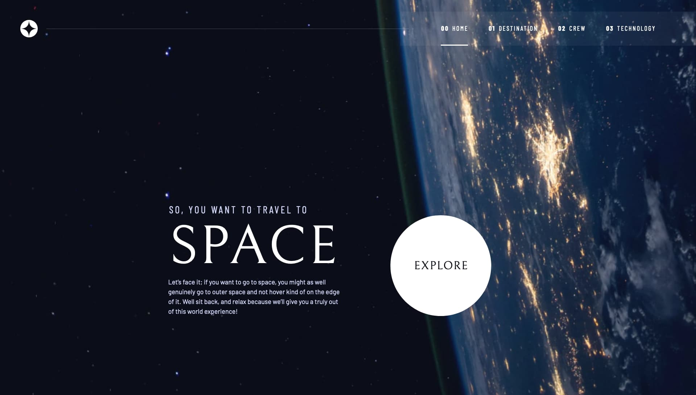

# Frontend Mentor - Space tourism website solution

This is a solution to the [Space tourism website challenge on Frontend Mentor](https://www.frontendmentor.io/challenges/space-tourism-multipage-website-gRWj1URZ3). Frontend Mentor challenges help you improve your coding skills by building realistic projects.

## Table of contents

- [Overview](#overview)
  - [The challenge](#the-challenge)
  - [Screenshot](#screenshot)
  - [Links](#links)
- [My process](#my-process)
  - [Built with](#built-with)
  - [Continued development](#continued-development)
- [Author](#author)
- [Acknowledgments](#acknowledgments)

## Overview

### The challenge

Users should be able to:

- View the optimal layout for each of the website's pages depending on their device's screen size
- See hover states for all interactive elements on the page
- View each page and be able to toggle between the tabs to see new information

### Screenshot

### Links

- Solution URL: [Github](https://github.com/graficdoctor/space-tourism-website)
- Live Site URL: [Deployed on Netlify](https://scintillating-griffin-3862a1.netlify.app/)

## My process

### Built with

- Semantic HTML5 markup
- CSS custom properties
- Flexbox
- CSS Grid
- Mobile-first workflow

### Continued development

This course is a perfect guide to **continued development**. I decided to follow this, so I could get more familiar using _utility classes_, how to name your classes and a more complete approach to writing CSS.
It has given me a lot of new information I will be implementing from now on. Or at least try to. Because it was nevertheless a tough exercise and there is a lot to be digested.

## Author

- Website - [Katrien S](https://www.katriens.be)
- Frontend Mentor - [@graficdoctor](https://www.frontendmentor.io/profile/graficdoctor)
- Twitter - [@graficdoctor](https://www.twitter.com/graficdoctor)

## Acknowledgments

I followed along with Kevin Powell's & Scrimba's collab [Build a Space Travel Website](https://v2.scrimba.com/build-a-space-travel-website-c014). Apart from the technology-pages, everything has been written just as Kevin explained.
